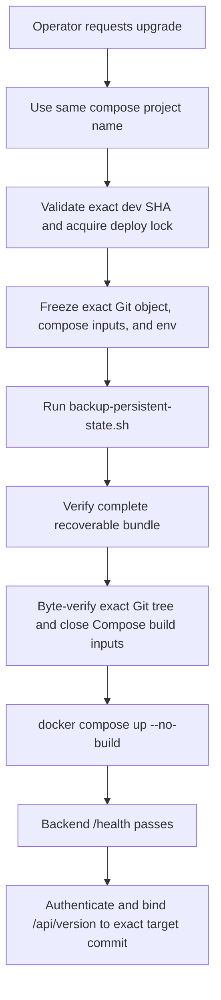

# Safe Upgrade Persistent-State Backup

## Summary

Trinity upgrades must preserve the operator's work before changing code or containers. Durable state includes the application database, every Compose named volume, agent runtime work in `agent-*-workspace` volumes, backend `/data`, and the `.env` recovery keys.

## State Model

| State | Location | Backup action |
|---|---|---|
| Platform database, SQLite | `/data/trinity.db` | SQLite online backup API, `PRAGMA integrity_check`, then verified archive |
| Platform database, PostgreSQL | Authority selected from backend `DATABASE_URL` | `pg_dump -Fc` restored into a fresh temporary PostgreSQL instance for bundled DB; fresh Ed25519-signed and provider-verified receipt for external DB |
| Credential encryption key and secrets | `.env` on host | Copy into chmod 600 `env.backup` |
| Skills/library runtime cache | backend `/data` | Archive `backend-data.tgz` |
| Agent runtime work | `agent-*-workspace` volumes mounted at `/home/developer` | Archive each volume to `agent-workspaces/*.tgz` |
| Compose-managed state | Every named volume mounted by the project, including Redis AOF, agent config, logs, and bundled DB storage | Pause all writers, archive each to `platform-volumes/*.tgz`, compare to the paused source, and prove inventory stability |
| Platform images | Docker image cache | Rebuild from source |

## Upgrade Flow

## Invariants

- A routine upgrade never runs `docker compose down -v`.
- A routine upgrade never runs `docker volume rm`.
- A routine upgrade does not silently change the compose project name, because that creates a second set of compose volumes.
- Agent containers are not removed as part of a platform upgrade. If the agent base image changes, recreate only after a persistent-state backup exists.
- External PostgreSQL requires a fresh signed receipt bound to the active `DATABASE_URL` digest plus a fresh attestation from a root-controlled provider verifier; a backup bundle without both is incomplete.
- The upgrade path has no backup-bypass option. Only an explicitly confirmed first install with no existing project containers or volumes may proceed without a backup.
- A completed bundle must contain all required recovery/authentication keys, a byte-equivalent restored backend archive, complete byte-equivalent Compose-volume and agent-workspace archives from stable inventories, and exactly one restored or provider-verified authoritative database artifact before any image build starts.
- Backend, scheduler, Redis, Vector, agent containers, and bundled PostgreSQL are paused whenever their physical state is copied.
- Governed builds reject tracked, untracked, ignored, assume-unchanged, and skip-worktree drift. Compose builds use a byte-verified extraction of the exact Git object, reject local or mutable build inputs outside it, and activate those frozen runtime inputs with `--no-build`.
- Automated deploy credentials are least-privilege: Tailscale access is tag-scoped to a dedicated OpenSSH port, SSH host identity is pinned, and the deploy key is restricted to `deploy <40-character SHA>`.
- Concurrent deploys serialize through a host lock and are never cancelled mid-upgrade.

## Entry Points

- `scripts/deploy/backup-persistent-state.sh`
- `scripts/deploy/safe-upgrade.sh`
- `scripts/deploy/github-actions-safe-deploy.sh`
- `.github/workflows/deploy-dev.yml`
- `docs/user-docs/guides/deploying/upgrading.md`
- `docs/user-docs/guides/deploying/backup-and-restore.md`
