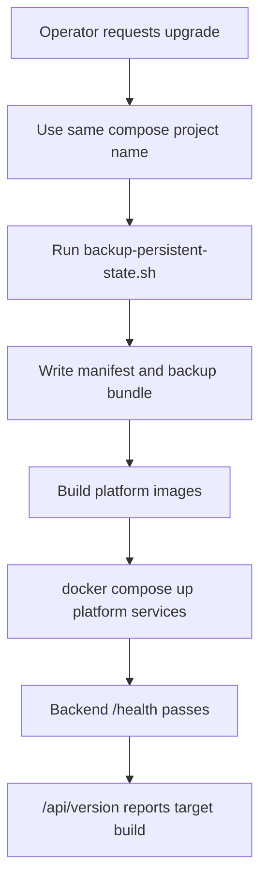

# Safe Upgrade Persistent-State Backup

## Summary

Trinity upgrades must preserve the operator's work before changing code or containers. The durable state is not just the application database: agent runtime work lives in `agent-*-workspace` Docker volumes, backend runtime artifacts live in `/data`, and encrypted credentials are unrecoverable without the `.env` encryption key.

## State Model

| State | Location | Backup action |
|---|---|---|
| Platform database, SQLite | `/data/trinity.db` plus WAL/SHM files | Archive from backend `/data` |
| Platform database, PostgreSQL | Bundled `postgres` service or external DB from `DATABASE_URL` | `pg_dump -Fc` for bundled service; managed snapshot/operator dump for external DB |
| Credential encryption key and secrets | `.env` on host | Copy into chmod 600 `env.backup` |
| Skills/library runtime cache | backend `/data` | Archive `backend-data.tgz` |
| Agent runtime work | `agent-*-workspace` volumes mounted at `/home/developer` | Archive each volume to `agent-workspaces/*.tgz` |
| Redis | `trinity_redis-data` | Not authoritative; regenerate sessions/counters |
| Platform images | Docker image cache | Rebuild from source |

## Upgrade Flow

## Invariants

- A routine upgrade never runs `docker compose down -v`.
- A routine upgrade never runs `docker volume rm`.
- A routine upgrade does not silently change the compose project name, because that creates a second set of compose volumes.
- Agent containers are not removed as part of a platform upgrade. If the agent base image changes, recreate only after a persistent-state backup exists.
- External PostgreSQL requires a managed snapshot or operator-provided dump; a backup bundle without the DB is incomplete unless explicitly allowed.

## Entry Points

- `scripts/deploy/backup-persistent-state.sh`
- `scripts/deploy/safe-upgrade.sh`
- `docs/user-docs/guides/deploying/upgrading.md`
- `docs/user-docs/guides/deploying/backup-and-restore.md`
